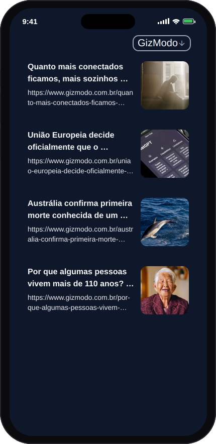
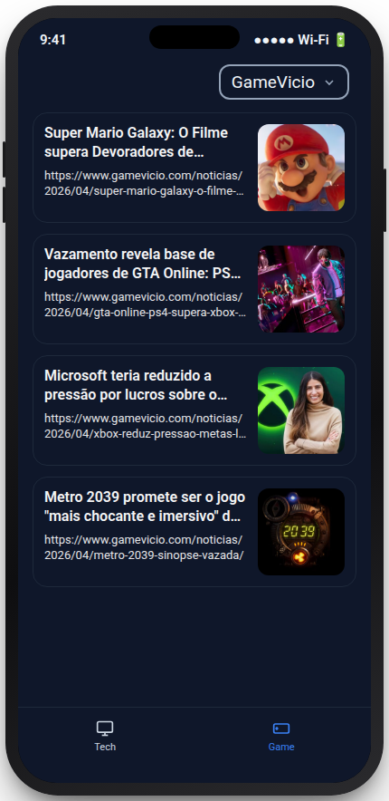

# Feed News (mobile)

Cliente **React Native**, agregador de notícias de tecnologia e games
[Feed News](https://github.com/MarceloVilela/feednews-next) — dezenas de portais brasileiros
reunidos em um feed único, agora também nativo (Android/iOS), consumindo a mesma API que já
alimenta a versão web.


<p align="center">
  
  
</p>

## Sobre

- **Agrega conteúdo real de dezenas de portais**: notícias de tecnologia e games de várias fontes
  reunidas num feed único, atualizado pela mesma API que alimenta a versão web — este app consome
  `GET /{tech,game}/source?url=<origem>` via Axios e renderiza o feed já agregado pelo backend
  (`feednews-next`).
- **Duas verticais, uma UI**: abas Tech e Game (`(tabs)` no Expo Router), cada uma com sua
  própria lista de origens (`src/assets/json/{tech,game}/origins.json`) e sua própria seleção de
  fonte ativa, guardada em `SettingsContext`.
- **Troca de fonte via modal**: o componente `Select` lista as origens disponíveis e troca o feed
  carregado sem sair da tela.
- **Leitor de artigo embutido**: ao tocar em uma notícia, o link abre dentro do próprio app em
  uma `WebView`, sem depender do navegador do sistema.
- **Catálogo de cards reaproveitável**: `src/components/Card` tem múltiplos layouts de item de
  feed (notícia, hero, grid, post, playlist) prontos para reuso — hoje o feed usa o layout
  `news`, mas trocar de layout é só mudar um parâmetro em `ArticleList`.

## Stack

| Camada | Tecnologias |
|---|---|
| Framework | Expo 54 (Expo Router, New Architecture) + TypeScript |
| UI | React Native, NativeWind (Tailwind para RN) |
| Navegação | Expo Router (stack) + React Navigation (bottom tabs) |
| Data fetching | Axios |
| Leitor de artigo | `react-native-webview` |
| Fontes/estado | Google Fonts (Roboto, Bai Jamjuree), Context API |

## Como funciona

```
App (tabs: Tech | Game)
    │
    ▼
SettingsContext ── origem selecionada
    │
    ▼
GET {apiUrl}/{tech,game}/source?url=<origem>   (backend feednews-next)
    │
    ▼
{ data: Content[], total }  ──▶  ArticleList  ──▶  NewsCard (FlatList)
    │
    ▼
toque no card ──▶ /article?url=<link>  ──▶  WebView
```

Não há backend neste repositório — a app depende de uma instância do
[`feednews-next`](https://github.com/MarceloVilela/feednews-next) rodando (local ou implantada)
para servir os endpoints `/tech/source` e `/game/source`.

## Rodando localmente

Requer Node e o `EAS CLI`/`Expo CLI` (via `npx`, sem instalação global obrigatória).

```bash
npm install
```

Copie `env.example.ts` para `env.ts` (arquivo local, fora do controle de versão) e ajuste a URL
da API do backend:

```bash
cp env.example.ts env.ts
```

`placeholder: true` faz o app usar dados de exemplo já versionados
(`src/assets/json/{tech,game}/placeholder.json`) em vez de bater na API — útil para rodar sem
backend disponível.

```bash
npm start        # expo start --clear
npm run android
npm run ios
```

## Estrutura do projeto

```
src/
├── app/                       # rotas (Expo Router)
│   ├── (tabs)/
│   │   ├── tech/articles/[origin].tsx
│   │   └── game/articles/[origin].tsx
│   ├── article.tsx            # leitor de artigo (WebView)
│   └── _layout.tsx
├── assets/json/{tech,game}/   # origens e dados de placeholder por vertical
├── components/
│   ├── ArticleList/           # lista + seleção de layout de card
│   ├── Card/                  # catálogo de layouts de card (news, hero, grid, post, playlist)
│   └── Select/                # modal de troca de origem
├── contexts/Settings.tsx      # origem ativa por vertical (tech/game)
└── lib/api.ts                 # instância Axios
```

## Status

Projeto em evolução: migrado recentemente de Expo 48 para Expo 54 (New Architecture, Expo
Router), ainda sem build publicado em loja — próximo passo do roteiro de portfólio é gerar um
APK instalável via EAS Build e, em seguida, publicar na Play Store.
